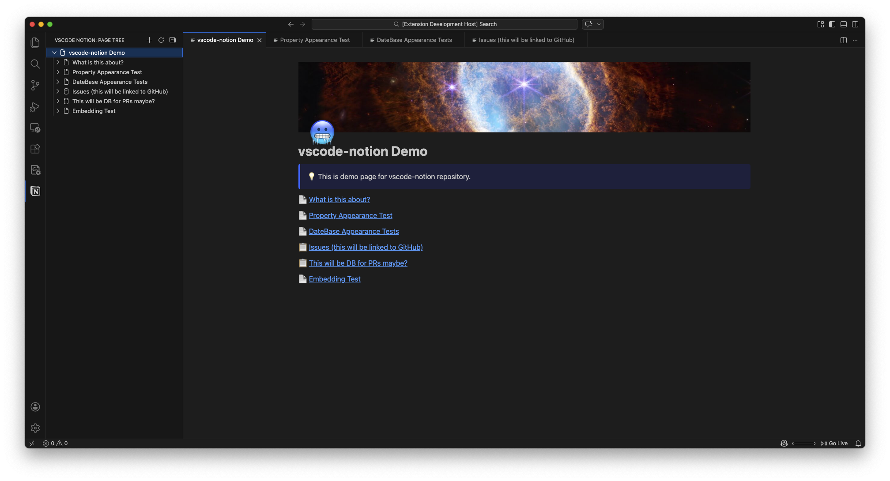
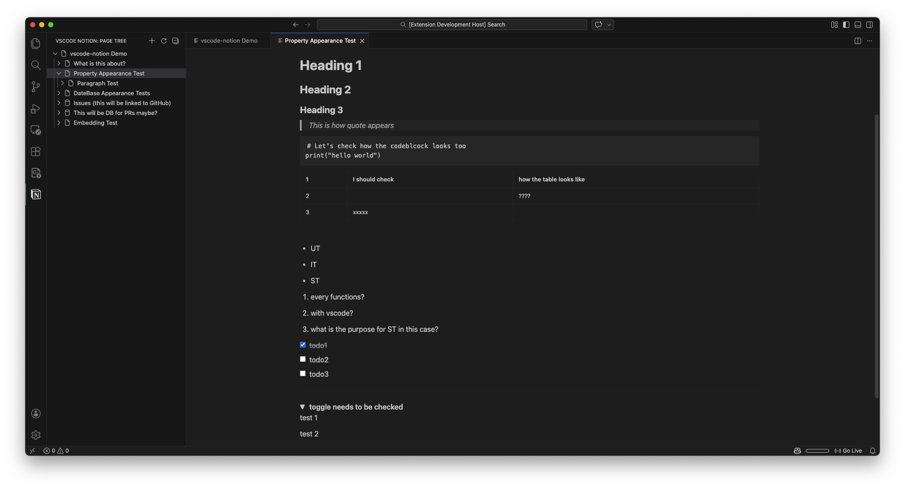
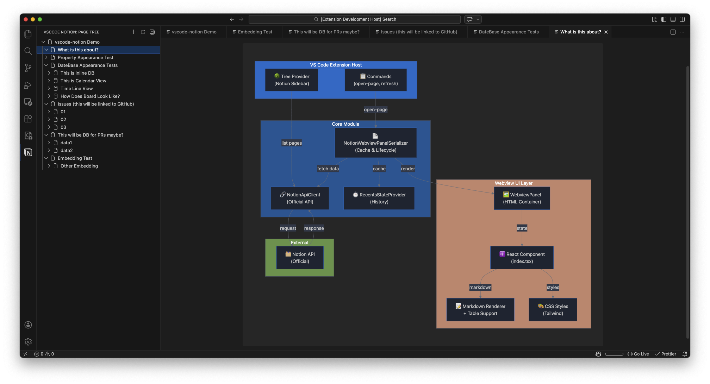
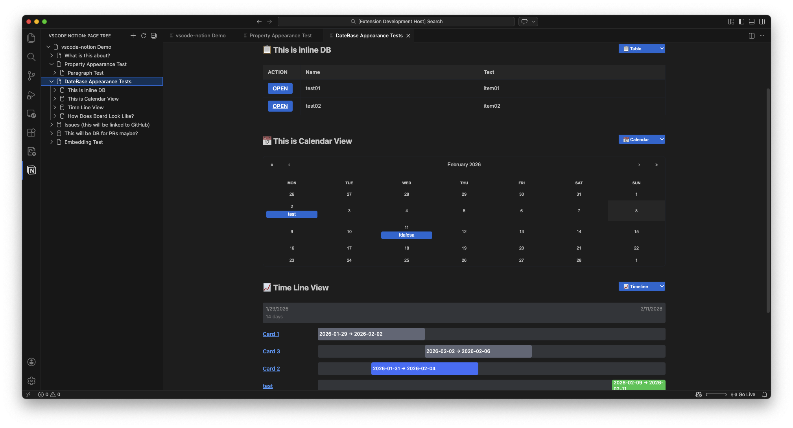

[English](README.md) | [日本語](docs/translations/README.ja.md)

# Notion-VSCode

> 🚀 Browse and explore your Notion pages directly in Visual Studio Code using official Notion integration.
>
> - Official Notion API: only pages shared with your integration API key are visible.
> - API call rate limits (average of 3 requests per second) can slow complex pages, but loaded pages are cached for fast display.

### 🙏 Credits

Big thanks to [kyswtn](https://github.com/kyswtn) for the original [vscode-notion](https://github.com/kyswtn/vscode-notion)! This project is forked from their work and recreated to use the **official Notion API**.

⚠️ **Important**: Due to conflicting extension IDs and commands, this extension cannot be used simultaneously with the original vscode-notion. Please disable or uninstall the original extension before installing this one.

---

|                  Front Page                  |                   Block Rendering                   |
| :------------------------------------------: | :-------------------------------------------------: |
|      |  |
|             **Mermaid Diagrams**             |               **Database Rendering**                |
|  |  |

## ✨ Features

- 📖 **Browse Notion Pages** - View your Notion workspace as a hierarchical tree in the sidebar
- 📄 **Full Markdown Support** - Rich text formatting, code blocks, callouts, and more
- 📊 **Inline Databases** - Table, Calendar, Timeline, and Board views
- 🎨 **Mermaid Diagrams** - Render diagrams directly in the preview
- 🌙 **Light & Dark Mode** - Seamlessly supports VS Code themes
- 🔒 **Official Notion API** - Uses Notion's official public API (no scraping)

## ⚠️ Limitations

- Your integration can only access pages that have been explicitly shared with it
- Editing is not supported (view-only)
- Some advanced Notion blocks may not render perfectly
- YouTube and Google Maps embeds cannot be rendered, but links are provided to view them in a browser
- Other embeds may not render correctly
- Notion embedded images expire after 1 hour; reload the page to fetch fresh images

## 🚀 Installation

1. Open VS Code
2. Go to Extensions (Ctrl+Shift+X / Cmd+Shift+X)
3. Search for **"Notion-VSCode"**
4. Click Install

## ✅ Quick Start

1. Create a Notion integration on [notion.com/integrations](https://www.notion.so/my-integrations)
2. Copy the **integration API key** from your integration settings
3. Grant the integration access to your pages
   (In Notion: Open a page → Click `⋯` (top right) → Connections → Select your integration)
4. Open VS Code Settings (macOS: Cmd+, / Windows, Linux: Ctrl+,) and set:
   - **Notion: Api Key** - Your integration's authentication token
   - **Notion: Cache Ttl Days** - Cache duration
   - **Notion: Root Page** - Starting page/database ID
5. Your Notion workspace appears in the sidebar

## 📚 Docs

- [Architecture](docs/ARCHITECTURE.md)

## 🐞 Reporting Issues

Report a bug or request a feature: [Open an issue](https://github.com/auditive-tokyo/Notion-VSCode/issues).

## 📄 License

This project is licensed under the **MIT License** - see the [LICENSE](LICENSE) file for details.
